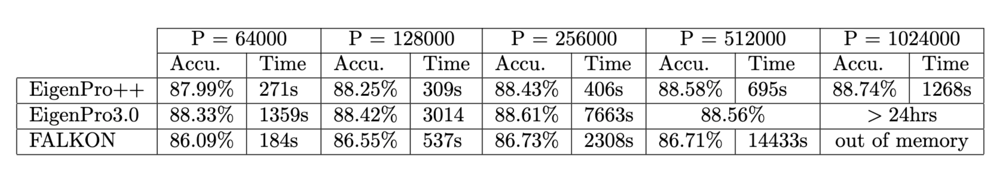
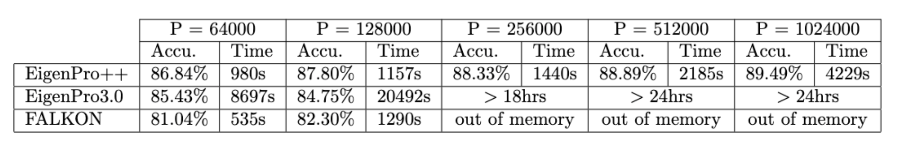
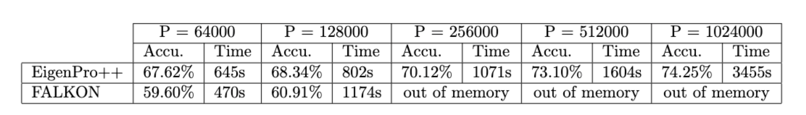
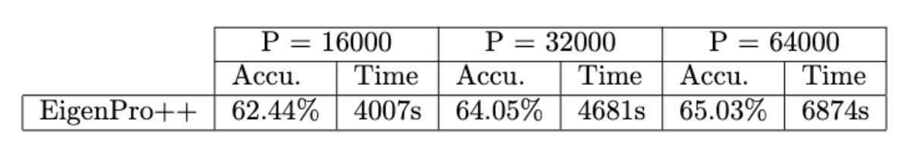

# EigenPro++

Introducing new EigenPro version.

## Installation

```
pip install git+ssh://git@github.com/EigenPro/EigenPro.git@extracted_model
```

### Test the installation
```python
import torch
from eigenpro.utils.device import Device
from eigenpro.kernels import laplacian
from eigenpro.models import create_kernel_model
from eigenpro.run import run_eigenpro

n, p, d, c = 500, 100, 5, 2
sd, sm, qd, qm = 10, 10, 3, 3

Z = torch.randn(p, d)
X_train, X_test = torch.randn(n//2, d), torch.randn(n//2, d)
W_star = torch.randn(d, c)
Y_train, Y_test = X_train @ W_star, X_test @ W_star

kernel_fn = lambda x, z: laplacian(x, z, bandwidth=20.)
device = Device.create(use_gpu_if_available=False)
model = create_kernel_model(Z, c, kernel_fn, device, dtype=torch.float32, tmp_centers_coeff=2)

model2 = run_eigenpro(model, X_train, Y_train, X_test, Y_test, device, dtype=dtype, kernel=kernel_fn,
                     s_data=sd, s_model=sm, q_data=qd, q_model=qm, epochs=2, accumulated_gradients=True)
print("Laplacian test complete!")
```
---

# Benchmark Results

## Performance Highlights
- **Performance Boost**: EigenPro++ offers up to **100x speed** increase from the previous version (EigenPro3.0) [[1]](#References).
- **Comparison with FALKON**: The memory requirement for FALKON fundamentally scales quadratically with the number of centers, EigenPro does not have this memory issue. Moreover, the latest version, EigenPro++, has successfully addressed the slow speed issue of EigenPro3.0, making it now faster than FALKON [[4-6]](#References) when number of centers are large.

## Benchmarking Details
In the experiments described below, 'P' denotes the number of centers(model size), essentially representing the model size, while 'd' signifies the ambient dimension. For all experiments, a Laplacian kernel with a bandwidth of 20.0 was employed.

### 1. CIFAR5M Extracted Features on single GPU

We used extracted features from the pretrained 'mobilenet-2' network available in the timm library. The benchmarks processed the full **5 million samples** of CIFAR5M with **d = 1280** for **one epoch** for all versions of EigenPro and FALKON. All of these experiments were run on a single A100 GPU. The maximum RAM we had access to was 1.2TB, which was not sufficient for FALKON with 1M centers.


<div align="center">
  
  <br>
  <em>Figure: Benchmark results for the CIFAR5M extracted feature dataset on a single GPU(A100).</em>
</div>


### 2. Libri speach Extracted Features on single GPU

The benchmarks processed the **10 million samples** with **d = 1024** for **one epoch** for all versions of EigenPro and FALKON. All of these experiments were run on a single V100 GPU. The maximum RAM available for this experiment was 300GB, which was not sufficient for FALKON with more than 128K centers. The features are extracted through a well-trained acoustic model (a VGG+BLSTM architecture in [[7]](#References) to align the length of audio and text. This is a 301-wise classification task where different class represents different uni-gram [[8]](#References). The implementation of extracting features is based on the ESPnet toolkit [[9]](#References) .

<div align="center">
  
  <br>
  <em>Figure: Benchmark results for the Libri speach extracted feature dataset on a single GPU(V100).</em>
</div>

### 3. CIFAR5M raw data on single GPU

We used raw features of CIFAR5M. The benchmarks processed the full **5 million samples** of CIFAR5M with **d = 3072** for **one epoch** for both EigenPro++ and FALKON. All of these experiments were run on a single V100 GPU. The maximum RAM we had access to was 300GB, which was not sufficient for FALKON with 256K centers.


<div align="center">
  
  <br>
  <em>Figure: Benchmark results for the CIFAR5M raw feature dataset on a single GPU(V100).</em>
</div>

### 4. CIFAR5M raw data on CPU with EigenPro++

We utilized the raw features from the CIFAR5M dataset. In our benchmarks, we processed a subset consisting of **1 million** samples from CIFAR5M, each with a dimensionality of d = 3072, for **a single epoch** using EigenPro++. These results demonstrate that EigenPro++ offers relatively fast performance, even when operating on a CPU with EigenPro++.

<div align="center">
  
  <br>
  <em>Figure: Benchmark results for the CIFAR5M raw feature dataset on CPU.</em>
</div>


---

# Tutorial: How to Use This Repository


** TODO: Edit this section. I would like to present [a test like this one](https://github.com/EigenPro/EigenPro-pytorch?tab=readme-ov-file#test-installation-with-laplacian-kernel)
Follow these steps to get started with this repository:

1. **Data Preparation**
   - Replace `X`, `Y`, `X_val`, and `Y_val` in `main.py` with your dataset variables.

2. **EigenPro Configuration**
   - **Scalability**: EigenPro++ is capable of running on a single GPU with support for up to 1M centers.
   - **Kernel and Bandwidth**: Configure your kernel and bandwidth in the EigenPro settings. Use `kernel_fn = None` for automatic selection.
   - **Precision**: Opt for `torch.float32` for higher precision. `float16` is generally sufficient for most datasets.
   - **Centers**: If your model centers is the same as the whole data set (traditional kernel machine), then set `use_all_x_as_centers = 1` to switch to EigenPro2.0 method, intoduced in [[2-3]](#References), which is a faster method for this special case.
     
4. **Execution**
   - Use `python main.py` in your command line to run the code.

---

# References
1. Abedsoltan, Amirhesam and Belkin, Mikhail and Pandit, Parthe, “Toward Large Kernel Models,” Proceedings of the 40th International Conference on Machine Learning, ICML'23, JMLR.org, 2023. [Link](https://proceedings.mlr.press/v202/abedsoltan23a/abedsoltan23a.pdf)
2. Siyuan Ma, Mikhail Belkin, "Kernel machines that adapt to GPUs for effective large batch trainin", Proceedings of the 2nd SysMLConference, 2019. [Link](https://mlsys.org/Conferences/2019/doc/2019/171.pdf)
3. Siyuan Ma, Mikhail Belkin, Diving into the shallows: a computational perspective on large-scale shallow learning, Advances in Neural Information Processing Systems 30 (NeurIPS 2017). [Link](https://proceedings.neurips.cc/paper_files/paper/2017/file/bf424cb7b0dea050a42b9739eb261a3a-Paper.pdf)
4. Giacomo Meanti, Luigi Carratino, Lorenzo Rosasco, Alessandro Rudi, “Kernel methods through the roof: handling billions of points efficiently,” Advances in Neural Information Processing Systems, 2020. [Link](https://proceedings.neurips.cc/paper_files/paper/2020/file/a59afb1b7d82ec353921a55c579ee26d-Paper.pdf)
5. Alessandro Rudi, Luigi Carratino, Lorenzo Rosasco, “FALKON: An optimal large scale kernel method,” Advances in Neural Information Processing Systems, 2017. [Link](https://papers.nips.cc/paper_files/paper/2017/file/05546b0e38ab9175cd905eebcc6ebb76-Paper.pdf)
6. Ulysse Marteau-Ferey, Francis Bach, Alessandro Rudi, “Globally Convergent Newton Methods for Ill-conditioned Generalized Self-concordant Losses,” Advances in Neural Information Processing Systems, 2019. [Link](https://arxiv.org/pdf/1907.01771.pdf)
7. Hui, L. and Belkin, M. "Evaluation of Neural Architectures Trained with Square Loss vs Cross-Entropy in Classification Tasks." In International Conference on Learning Representations, 2021. [Link](https://arxiv.org/abs/2006.07322)
8. Jurafsky, D. Speech & language processing. Pearson Education India, 2000
9. Watanabe, et. al. ESPnet: Toward large kernel models End-to-end speech processing toolkit. In Proceedingsof Interspeech, pp. 2207–2211, 2018. doi: 10.21437/Interspeech.2018-1456 [Link](https://www.isca-speech.org/archive/interspeech_2018/watanabe18_interspeech.html)


