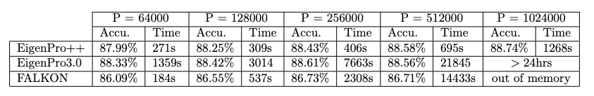

# Benchmark Results

## Performance Highlights
- **Performance Boost**: The new version of EigenPro offers an estimated *100x speed* increase from the previous version.
- **Comparison with FALKON**: The memory requirement for FALKON fundamentally scales quadratically with the number of centers, necessitating the use of 1.2 terabytes of RAM for conducting experiments with 512,000 centers. In contrast, our algorithm requires only 200 gigabytes of RAM. The latest version of our algorithm has successfully addressed the slow speed issue of the previous one, making it now faster than FALKON.

## Benchmarking Details
Benchmarks were conducted on the CIFAR5M dataset using extracted features from the pretrained 'mobilenet_2' network available in the timm library. The benchmarks processed the full 5 million samples of CIFAR5M for one epoch/iteration for all versions of EigenPro and FALKON. (P in the following table stands for number of centers)

---

# Tutorial: How to Use This Repository

## Data Preparation
Replace `X`, `Y`, `X_val`, and `Y_val` in `main.py` with your dataset variables.

## EigenPro Configuration
- **Scalability**: The latest version is capable of running on a single GPU with support for up to 1M centers.
- **Kernel and Bandwidth**: Configure your kernel and bandwidth in the EigenPro settings. Use `kernel_fn = None` for automatic selection.
- **Precision**: Opt for `torch.float32` for higher precision. `float16` is generally sufficient for most datasets.

## Usage
Review the comments in `run_eigenpro` to select the best configuration for your use case.

## Execution
To run the updated EigenPro, execute `python main.py` in your command line.

